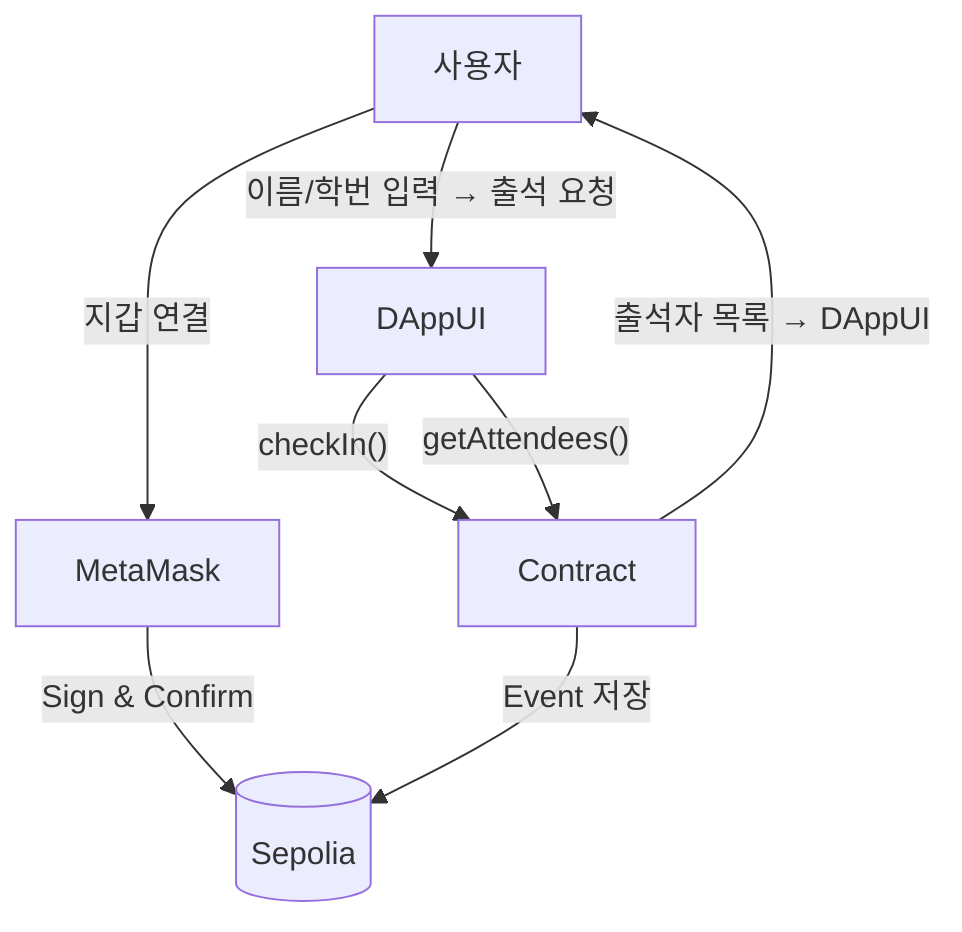

## 🎓 출석 NFT 시스템 (Attendance NFT DApp)

> 블록체인 기반 **출석 인증 시스템**<br></br>
> 사용자는 **이름 + 학번** 입력 후, **메타마스크로 출석을 인증**<br></br>
> 트랜잭션이 블록체인에 기록되고 **출석 내역이 누구나 검증 가능**

---

### 🧾 주요 기능

| 기능                         | 설명                                              |
| ---------------------------- | ------------------------------------------------- |
| ✅ MetaMask 지갑 연결        | 사용자의 이더리움 계정을 UI에서 확인 및 복사 가능 |
| ✅ 출석 제출 (트랜잭션 발생) | 이름 + 학번을 컨트랙트에 저장                     |
| ✅ 출석 횟수 표시            | 블록체인에서 실시간 조회                          |
| ✅ 출석자 목록 조회          | 출석한 모든 사용자 표시 (이름 / 학번 / 지갑 주소/ 타임스탬프) |
| ✅ 트랜잭션 확인 링크 제공   | Etherscan에서 직접 출석 기록 확인 가능            |
| ✅ 네트워크 자동 전환        | 메인넷이 아닌 **Sepolia 테스트넷**으로 자동 전환  |

---

### 🛠️ 사용 기술

| 영역           | 기술                                          |
| -------------- | --------------------------------------------- |
| Smart Contract | Solidity                                      |
| Frontend       | Next.js (App Router), React, Tailwind CSS     |
| Web3 연동      | ethers.js v6, MetaMask Provider               |
| 배포           | Vercel (Frontend), Sepolia Testnet (Contract) |

---

### 🌐 DApp 작동 흐름



---

### ♦️ 컨트랙트 배포 (Sepolia)

1. **Remix** 연결 → MetaMask 네트워크를 `Sepolia`로 설정
2. **Compile** (0.8.x)
3. **Deploy & Run** 탭

   - Environment: `Injected Provider (MetaMask)`
   - Network: `Sepolia`
   - `Deploy` → MetaMask Confirm

4. 배포 성공 후 **Contract Address 복사**
5. 프로젝트의 `/src/lib/constants.ts` 수정:

```ts
export const contractAddress = '여기에_배포한_주소_붙여넣기';
```

---

### 📜 Smart Contract (출석 기록 저장)

```solidity
// SPDX-License-Identifier: MIT
pragma solidity ^0.8.0;

contract AttendanceNFT {
    struct Attendance {
        address wallet;
        string name;
        string studentId;
        uint256 timestamp;
    }

    mapping(address => mapping(uint256 => bool)) public checkedIn; 
    Attendance[] public records;
    uint256 public totalCount;

    event CheckedIn(address wallet, string name, string studentId, uint256 timestamp);

    function checkIn(string memory name, string memory studentId) public {
        uint256 today = block.timestamp / 1 days;

        require(!checkedIn[msg.sender][today], "Already checked in today.");

        checkedIn[msg.sender][today] = true;
        records.push(Attendance(msg.sender, name, studentId, block.timestamp));

        totalCount++;
        emit CheckedIn(msg.sender, name, studentId, block.timestamp);
    }

    function getRecords() public view returns (Attendance[] memory) {
        return records;
    }
}
```

---

### 💻 실행 방법 (로컬)

```bash
git clone https://github.com/annseojin/attendance-nft.git
cd attendance-nft
npm install
npm run dev
```
